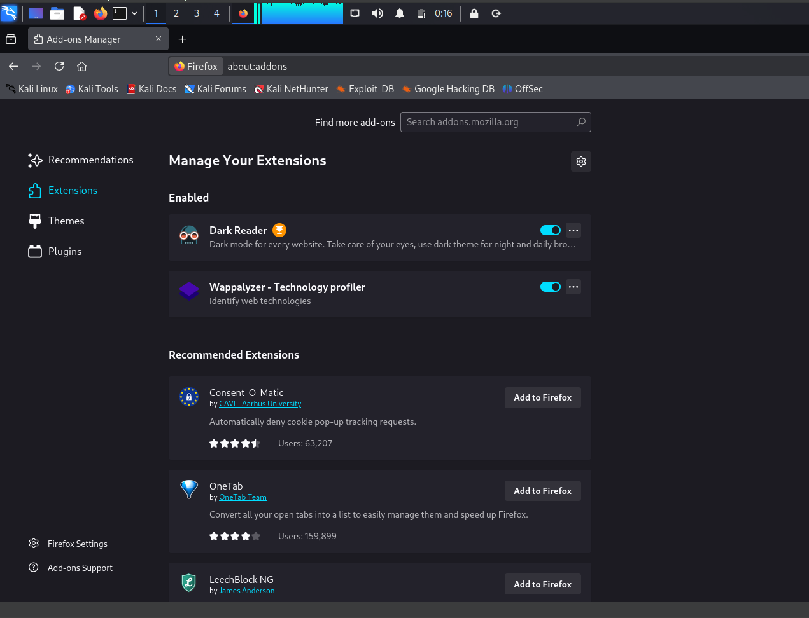
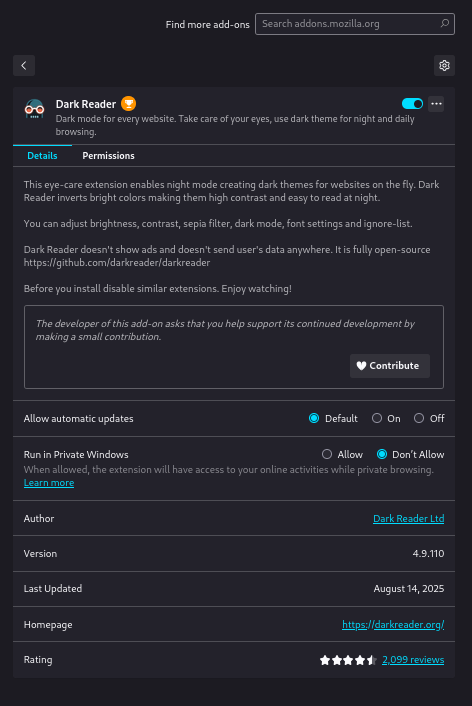
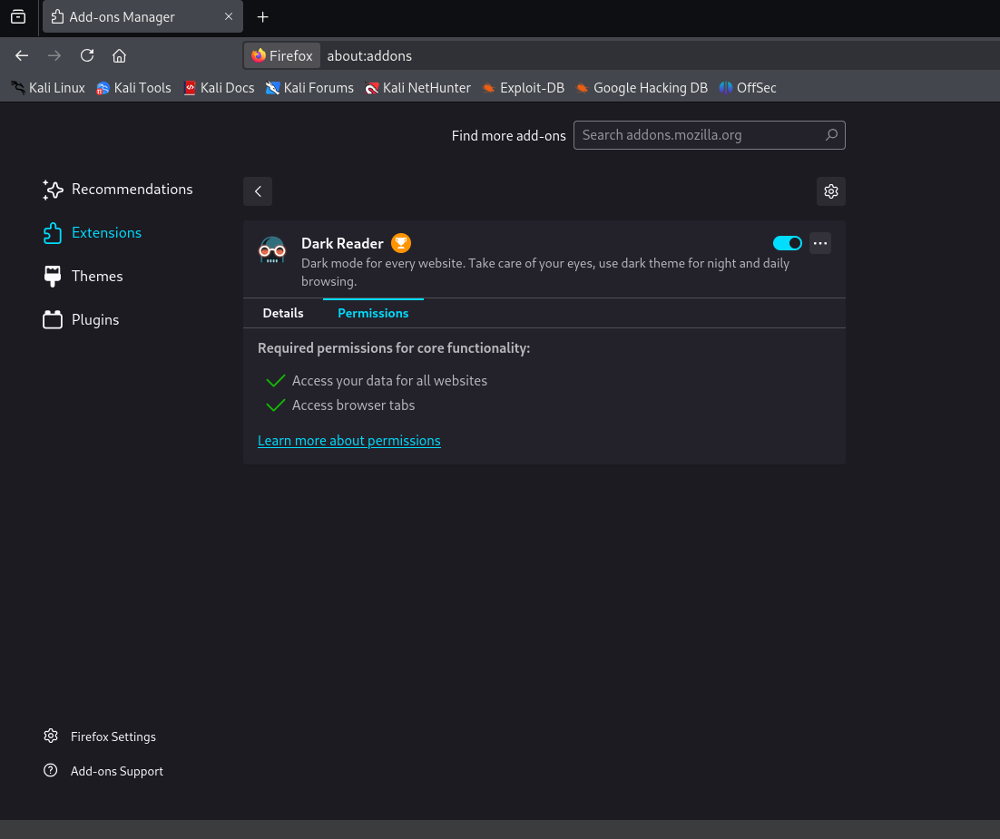
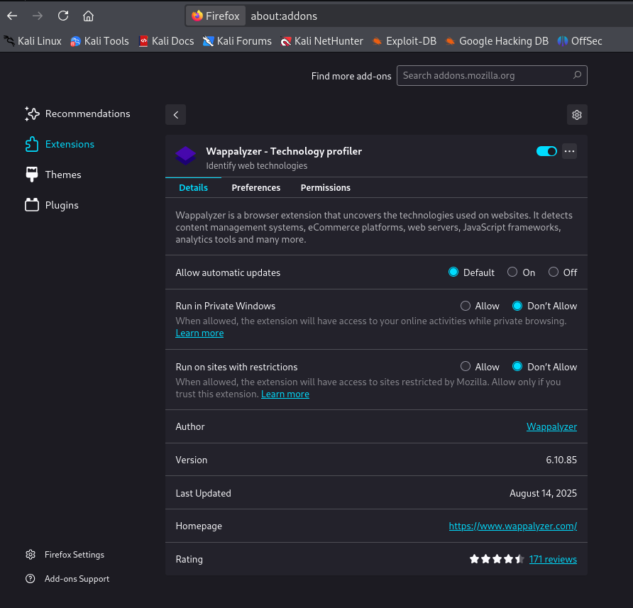
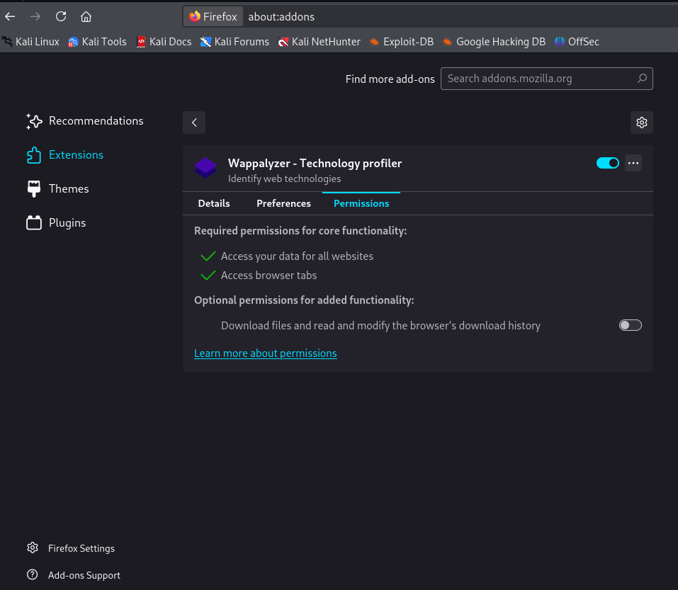
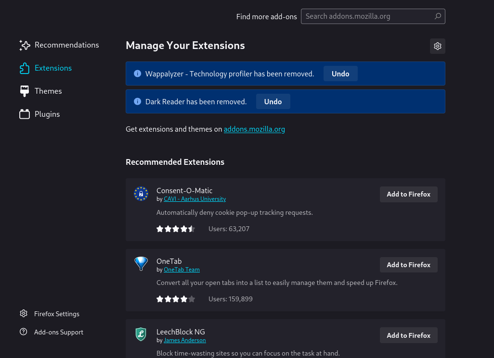
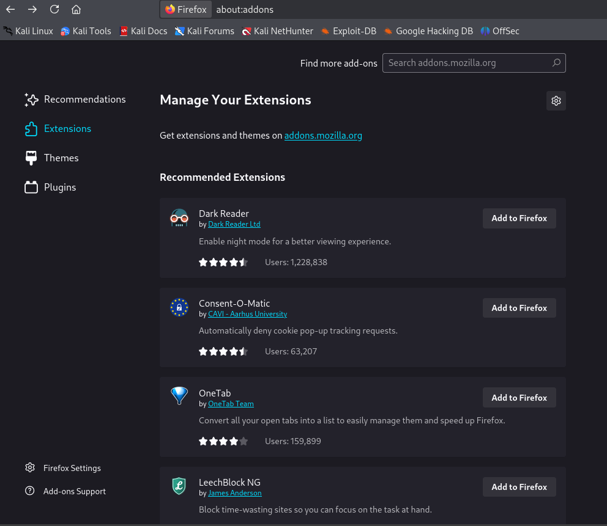

# CyberSecurity_Task_7

##  Objective
The objective of this task was to identify suspicious or unnecessary browser extensions in **Mozilla Firefox**, review their permissions, and remove them to enhance security.

---

##  Steps Performed

1. Opened **Firefox Add-ons Manager** by navigating to:
2. Checked installed extensions:
- **Dark Reader** (enables dark mode for websites)
- **Wappalyzer – Technology Profiler** (identifies website technologies)
3. For each extension, opened **Manage** and reviewed:
- Permissions
- Developer information
- Last updated date
- Purpose
4. Found that both extensions required **broad permissions**:
- Access your data for all websites
- Access browser tabs
- Wappalyzer also requested optional permissions for downloads and browser history
5. **Decision:**
- **Dark Reader** – Legit but unnecessary for my browsing needs → Removed
- **Wappalyzer** – Broad access, unnecessary → Removed
6. Removed both extensions and verified clean state.
7. Captured screenshots at every stage.

---

##  Review Log

| **Extension**   | **Permissions**                                                      | **Developer**     | **Decision** | **Reason**                                 |
|-----------------|----------------------------------------------------------------------|-------------------|-------------|----------------------------------------------|
| Dark Reader     | Access data for all websites, access tabs                            | Dark Reader Ltd   | Removed      | Safe but unnecessary for my use             |
| Wappalyzer      | Access data for all websites, access tabs, optional: read downloads  | Wappalyzer        | Removed      | Broad permissions, not needed for daily use |

---

##  Screenshots

### **Before Removal (Installed Extensions)**

---

### **Dark Reader Details**

### **Dark Reader Permissions**

---

### **Wappalyzer Details**

### **Wappalyzer Permissions**

---

### **After Removal (Both Removed)**

---

### **Final Clean Extensions List**

---

##  Key Learnings

- Browser extensions can have **very broad permissions**, which can be risky if misused.
- Always verify:
- Source (official store)
- Permissions requested
- Developer details
- Remove any unnecessary or suspicious extensions to minimize risk.
- Regularly review installed extensions for security.

---

##  Best Practices for Extension Safety

- Install only from official sources like Mozilla Add-ons.
- Check permissions before installing.
- Remove unused extensions immediately.
- Keep extensions updated for latest security patches.
- Report suspicious add-ons through the official report feature.

---

